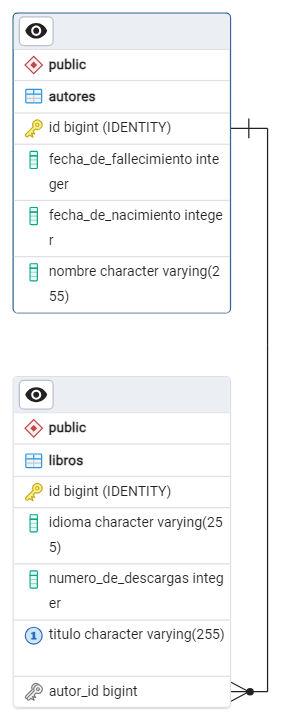
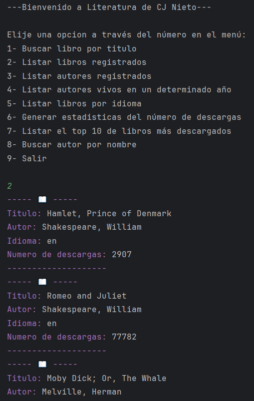
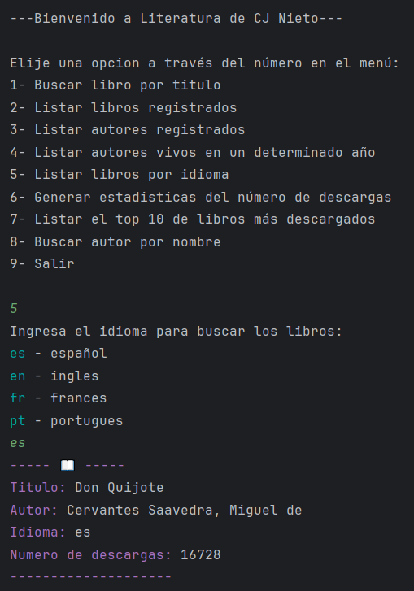
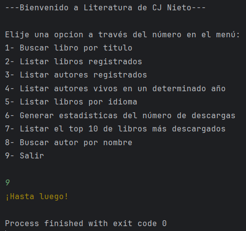

<p align="center">
  	
</p>

# Catálogo de Libros - Oracle y Alura Challenge

Este es un proyecto desarrollado con Spring Boot para el Challenge LiterAlura de Alura para Oracle Next Generation (ONE).

## Descripción

El proyecto **Literatura** es una aplicación de consola desarrollada con Spring Boot que utiliza PostgreSQL para gestionar libros y autores. La aplicación permite realizar diversas operaciones como buscar libros por título, listar todos los libros registrados, buscar autores por nombre, entre otras funcionalidades.

## Funcionalidades

- Busca un libro en una API externa y lo guarda en la base de datos si se encuentra.
- Muestra todos los libros almacenados en la base de datos.
- Muestra todos los autores almacenados en la base de datos.
- Busca autores que fallecieron después del año ingresado.
- Filtra los libros según el idioma especificado.
- Muestra estadísticas sobre el número total de descargas de los libros.
- Muestra los 10 libros más descargados.
- Busca autores por nombre en la base de datos.

## Tecnologías Utilizadas

- **Java 17**
- **Spring Boot 3.3.2-SNAPSHOT**
- **PostgreSQL**
- **Maven**
- **Lombok**
- **JPA / Hibernate**
- **Jackson para procesamiento JSON**
- **Jansi para colorear la salida en la consola**

## Estructura del Proyecto

El proyecto está organizado en los siguientes paquetes:

- **`__Literatura`**: Contiene la clase principal `Application` para iniciar la aplicación.
- **`.service`**: Contiene la clase `ConsumeApi` para consumir la API externa de libros.
- **`.repository`**: Contiene los repositorios `BookRepository` y `AuthorRepository` para interactuar con la base de datos.
- **`.principal`**: Contiene la clase `Principal` que maneja el menú y la lógica de la aplicación.
- **`.model`**: Contiene las clases de entidad `Book` y `Author` que representan las tablas en la base de datos.
- **`.dto`**: Contiene las clases `DataBook`, `DataAuthor`, y `Data` para representar los datos obtenidos de la API externa.
- **`.converter`**: Contiene la interfaz `IConverter` y la clase `Converter` para convertir datos JSON a objetos Java.

El modelo de base de datos se observa de la siguiente manera:
<p align="center">
  	
</p>

## Instalación

Sigue estos pasos para configurar el proyecto en tu entorno local:

1. **Clona el repositorio:**
	```
	git clone https://github.com/tu_usuario/03_Literatura.git
	cd 03_Literatura
	```
 
2. **Configura las credenciales de la base de datos:**
Abre el archivo application.properties y reemplaza `tu_usuario` y `tu_contraseña` con tus credenciales de PostgreSQL.
	```
	spring.datasource.username=tu_usuario
	spring.datasource.password=tu_contraseña
	```
 
3. **Compila el proyecto:**
Asegúrate de tener Maven instalado y ejecuta:
	```
	mvn clean install
	```
 
4. **Ejecuta la aplicación:**
	```
	mvn spring-boot:run
	```

## Uso

Una vez que la aplicación esté corriendo, verás un menú en la consola con las siguientes opciones:

1. Buscar libro por título
2. Listar libros registrados
3. Listar autores registrados
4. Listar autores vivos en un año determinado
5. Listar libros por idioma
6. Generar estadísticas del número de descargas
7. Listar el top 10 de libros más descargados
8. Buscar autor por nombre
9. Salir

Ingresa el número correspondiente a la opción que deseas ejecutar. Conforme avances las opciones se podrán mostrar de la siguiente forma:
<p align="center">
  	
</p>
<p align="center">
  	
</p>
<p align="center">
  	
</p>

## Contribuciones

Las contribuciones son bienvenidas. Si tienes ideas para mejorar el proyecto, por favor, abre un issue o envía una pull request.

## Licencia

Este proyecto está licenciado bajo la [MIT License](LICENSE.md).
